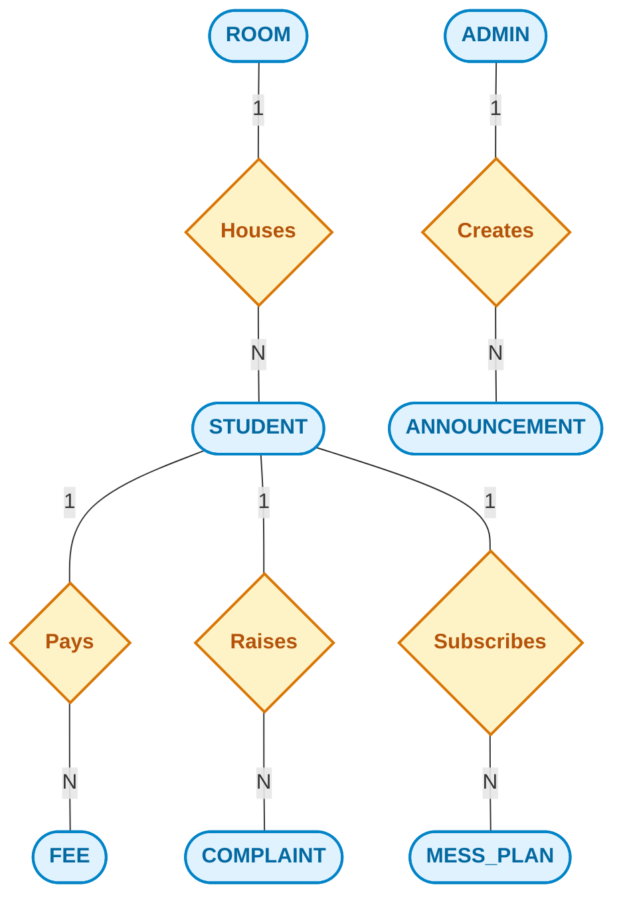
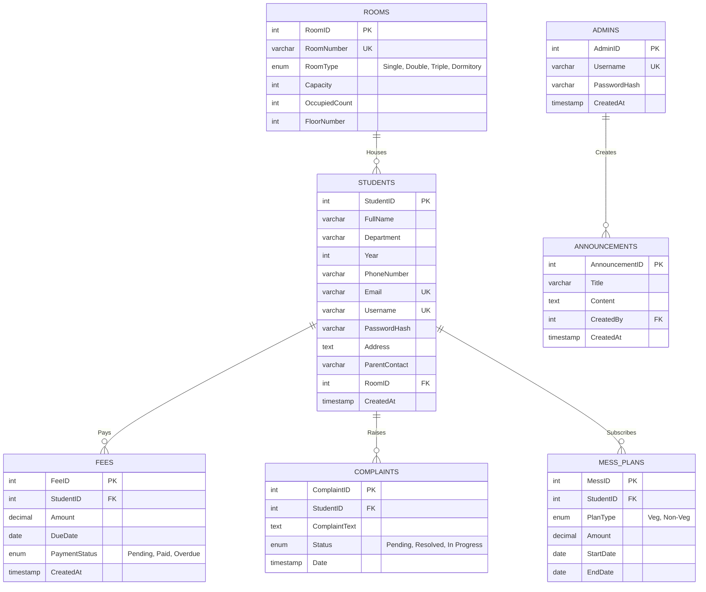

# Dayananda Sagar Institutions Hostel Management System 🏫

A comprehensive, production-ready Full-Stack Web Application designed specifically as a **Database Management System (DBMS) Mini Project**. This platform provides an intuitive administrative dashboard to seamlessly manage students, rooms, fee collections, mess plans, and hostel complaints.

## 🌟 Project Highlights

- **Frontend**: React.js, TailwindCSS, Vite, Recharts, Lucide Icons
- **Backend**: Node.js, Express.js
- **Database**: MySQL 8.0
- **Architecture**: RESTful API with MVC pattern

---

## 💾 Database Architecture (DBMS Focus)

This project heavily relies on advanced SQL and RDBMS concepts to maintain data integrity, security, and performance. 

### 1. Conceptual ER Diagram

This diagram represents the high-level conceptual model of the system, showing Entities (represented as rounded rectangles), Relationships (represented as diamonds), and their corresponding connections with cardinalities.



### 2. Relational Schema Diagram

This diagram represents the logical schema, explicitly detailing tables, attributes, primary keys (PK), foreign keys (FK), unique constraints (UK), and database types.



### 3. Advanced DBMS Concepts Implemented

To demonstrate a deep understanding of database management, this project implements several core RDBMS features at the SQL engine level.

#### A. Database Triggers (Automated State Management)
Instead of relying on backend JavaScript logic to update room occupancies, the system utilizes **MySQL Triggers** to strictly enforce real-time data consistency and ACID properties.
*   **`AfterStudentInsert`**: Automatically increments the `OccupiedCount` in the `Rooms` table whenever a new student is assigned a room.
*   **`AfterStudentUpdate`**: Automatically adjusts the `OccupiedCount` of both the old room and the new room when a student is reassigned.
*   **`AfterStudentDelete`**: Automatically decrements the `OccupiedCount` when a student leaves the hostel or is deleted.

#### B. Relational Integrity & Cascading
The system enforces strict referential integrity using **Foreign Key Constraints**:
*   `ON DELETE CASCADE`: If a `Student` record is deleted from the database, all associated records in `Fees`, `Complaints`, and `MessPlans` are automatically destroyed, preventing orphaned records.
*   `ON DELETE SET NULL`: If a `Room` is removed from the system, the `RoomID` inside the `Students` table is safely set to `NULL` rather than deleting the student data.

#### C. SQL Views (Virtual Tables for Analytics)
To optimize complex data retrieval for the frontend dashboard and reports, the database utilizes predefined **Views**:
*   **`FeeReportsView`**: Abstracts a complex `JOIN` operation between the `Fees` and `Students` tables, securely exposing the student's name, department, and payment status in a single virtual table for frontend data grids.
*   **`RoomOccupancyView`**: Abstracts dynamic arithmetic operations `(Capacity - OccupiedCount)` and `CASE/WHEN` logic to instantly classify rooms as 'Full', 'Empty', or 'Partially Occupied' directly at the database layer.

---

## 🚀 Features

1. **Intelligent Dashboard**: Real-time statistical metrics powered by SQL aggregation (`COUNT`, `SUM`, `GROUP BY`).
2. **Room Management**: Visual allocation of 88 multi-floor rooms with automatic occupancy prevention checks.
3. **Automated Fee Logic**: Intelligent fee calculation logic where Old Students are charged ₹180,000 and New Students (Year 1) are charged ₹185,000 (incorporating a ₹5,000 security deposit).
4. **Complaint Resolution System**: Track resident grievances from 'Pending' to 'Resolved'.
5. **Secure Authentication**: Encrypted administrator credentials.

---

## ⚙️ Installation & Setup

### Prerequisites
- **Node.js** (v16+ recommended)
- **MySQL Server** (Running locally or hosted)

### 1. Database Setup
1. Open MySQL Workbench or your terminal.
2. Ensure you have your MySQL credentials ready.
3. The application will auto-generate the database upon initialization.

### 2. Environment Variables
Create a `.env` file in the `/backend` directory:
```env
DB_HOST=localhost
DB_USER=root
DB_PASSWORD=your_mysql_password
DB_NAME=hostel_management
JWT_SECRET=supersecretjwtkey_for_authentication
PORT=5000
```

### 3. Backend Initialization
```bash
cd backend
npm install

# Run the automated database builder (Creates Schema, Views, and Triggers)
node init_db.js 

# Start the server
npm start
```

### 4. Frontend Initialization
```bash
cd frontend
npm install

# Start the Vite development server
npm run dev
```

---

*This project was developed as a comprehensive demonstration of Full-Stack engineering combined with strict, optimized Database Management System principles.*
